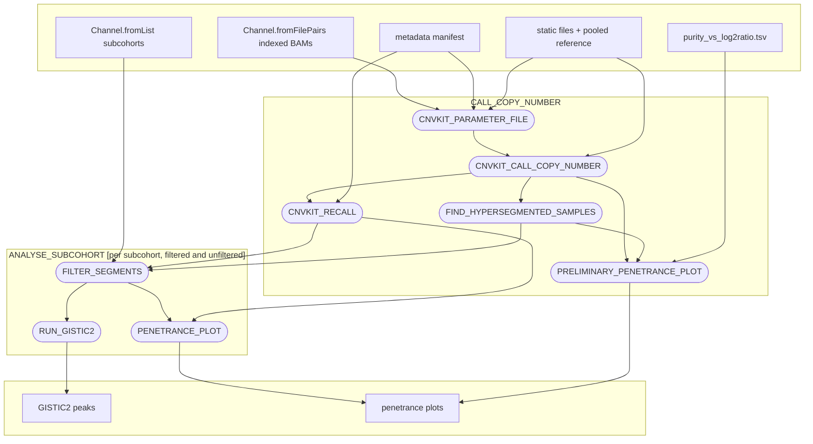

# dermatlas_unmatched_copynumber_nf

[](https://www.nextflow.io/)
[](https://www.docker.com/)
[](https://sylabs.io/docs/)

## Introduction

dermatlas_unmatched_copynumber_nf is a bioinformatics pipeline written in [Nextflow](http://www.nextflow.io)
for calling copy number alterations from tumour-only whole-exome sequencing in the Dermatlas project - that
is, without a matched normal for each tumour. In place of a matched normal, every tumour is compared against a
**pooled normal reference** built once per baitset from a set of unrelated normals.

It builds on [fur-cnvkit](https://gitlab.internal.sanger.ac.uk/DERMATLAS/fur/fur_cnvkit), a CNVkit extension
developed in the Adams lab at WTSI for the FUR project to do QC and CNA calling in FFPE cohorts, and replaces
the `unmatched_copynumber` wrapper scripts.

## Pipeline summary

Given a cohort's indexed BAMs and its metadata manifest, the pipeline:

- assembles the CNVkit parameter file for the cohort, using the static files (accessible regions, targets,
  antitargets, baitset genes) that the pooled reference was built from
- calls copy number for every tumour against the male or female pooled reference, according to the sample's sex
- identifies **hypersegmented** samples from the cohort's own CNVkit metrics and excludes them from everything
  downstream
- draws a sweep of **preliminary penetrance plots**, one per tumour purity in `purity_vs_log2ratio.tsv`, to
  show which log2 ratio thresholds fit the cohort
- **re-calls** the integer `cn` column per sample with the chosen thresholds, leaving the log2 ratios untouched
- per subcohort, filters segments, exports a GISTIC2 `.seg` file, draws the final penetrance plot and runs
  **GISTIC2** - twice: once over the filtered segments and once over the unfiltered ones

The filtered and unfiltered arms are not an alternative to each other. Filtering drops segments that overlap
difficult regions or are too short, and scoring both arms is how you see whether it also dropped something
real (a focal *MYC* amplification, a *TP53* deletion).

## Entry points

| Entry | Command | When |
| --- | --- | --- |
| default | `nextflow run ... ` | Call a cohort against an existing pooled normal reference. This is nearly always the one you want. |
| `BUILD_REFERENCE` | `nextflow run ... -entry BUILD_REFERENCE` | Generate the static files and pooled normal reference for a **new baitset**. Days of compute, done once, then reused by every cohort on that baitset. |

The Dermatlas WES5 reference (25 male and 25 female normals from the hidradenoma cohort 6513_2706) is the
farm22 profile's default, so a standard Dermatlas cohort never runs `BUILD_REFERENCE`.

## Inputs

### Cohort-dependent variables

- `bam_path`: glob matching the cohort's indexed BAMs **and** their `.bai` indexes, e.g.
  `"/path/to/bams/**bam{,.bai}"`. It must match **exactly two files per sample** - BAMs are paired by
  `Channel.fromFilePairs(..., size: 2)`, which silently drops any sample matching one file or three or more.
  In the Dermatlas layout each sample lives in its own subdirectory alongside `.bam.bas` and `.bam.met.gz`
  files, so `**` is needed to descend into those subdirectories and the `{,.bai}` brace is needed to exclude
  the other siblings. A looser glob such as `"/path/to/bams/*.bam*"` matches nothing usable and produces a run
  that succeeds with no output.
- `metadata_manifest`: tab-delimited manifest for the cohort. Three columns are read, named by
  `col_sample_id` (default `Sanger_DNA_ID`), `col_sex` (`Sex`, values `M`/`F`/`U`) and `col_TN` (`Phenotype`,
  values `T`/`N`). **It must be a TSV**: the pipeline reads the sex column itself to re-call `cn` per sample,
  which it cannot do from an `.xlsx` sheet. Export the sheet and point at the export.
- `all_samples`: the tumours the study has agreed to analyse, one id per line. This decides which of the BAMs
  matched by `bam_path` are called at all, so a BAM left behind in the directory does not become a sample.
  **Required.**
- `exclude_samples` *(optional)*: sample ids to drop entirely, one per line. Applied before anything is
  scheduled, so an excluded sample costs no compute.
- `cohort_prefix`: prefix for every sample list, `.seg` file and plot the run produces. **Required.**
- `study_id`: study identifier, carried on the run's meta maps.
- `subcohorts`: a map of one or more subcohorts to analyse from the same set of calls. Each key is the
  subcohort name (and its output sub-directory under `outdir`); each value needs a `sample_list`, and may
  carry an `exclude_list`. Without one, the subcohort excludes the samples this run found to be
  hypersegmented, which is almost always what you want.

```groovy
subcohorts = [
    "all_tumours":            [ sample_list: "/path/to/6937_3125-analysed_all_tum.txt" ],
    "one_tumour_per_patient": [ sample_list: "/path/to/6937_3125-one_tumour_per_patient_all_tum.txt" ]
]
```

### Choosing the thresholds

`call_thresholds` are the log2 ratio boundaries for CN=0, 1, 3 and 4 that CNVkit calls with, and default to
`'-0.737,-0.322,0.263,0.485'` - the theoretical values for a 40%-purity tumour. `recall_thresholds` are the
ones the run re-calls `cn` with, and default to the same, in which case re-calling changes nothing.

This is the one place the pipeline expects a human in the loop. Every run publishes a sweep of penetrance
plots to `<outdir>/cnvkit_cn_penetrance_plots/`, one per purity in `purity_vs_log2ratio.tsv`:

```
penetrance_plot.purity0.40_gain0.263_loss-0.322.pdf
```

Read them the way the original workflow did. Many small recurrent spikes near centromeres, telomeres and
reference gaps are artefacts and argue for a higher threshold; losing whole chromosome arms as the threshold
rises means it is already too stringent. When a different purity fits the cohort better, set
`recall_thresholds` to that row's CN0, CN1, CN3 and CN4 columns and run again. Everything downstream - the
re-called `cn` values, the final plots and GISTIC2's amplitude cut-offs - follows from that one line.

The theoretical thresholds come from

```
log2(FC) = log2( (p * CN_tumour + (1 - p) * 2) / 2 )
```

for purity `p` and a diploid baseline; `purity_vs_log2ratio.tsv` is that calculation tabulated for CN=0 to 5.

### Filtering

| Param | Default | Effect |
| --- | --- | --- |
| `weight_filter_threshold` | `30` | segments with a CNVkit `weight` below this are dropped during calling |
| `min_average_segment_size` | `4000000` | a sample whose *average* segment is shorter than this is hypersegmented and excluded from every subcohort |
| `bed_overlap_threshold` | `0.6` | a segment overlapping `difficult_regions` by at least this fraction of its length is dropped (filtered arm) |
| `min_segment_size` | `400000` | segments shorter than this are dropped (filtered arm) |
| `segment_weight` | `30` | segments with a weight below this are dropped (filtered arm) |

The `*.removed.cns` file published beside each subcohort's filtered segments lists exactly what filtering
took out. It is worth reading: a known event lost here is the signal that the filters are too aggressive for
this cohort.

### Cohort-independent variables

Reference data - the genome and its index, the baitset BED, refFlat, the four static files, the two pooled
reference `.cnn` files, `purity_vs_log2ratio.tsv`, the GISTIC2 refgene `.mat` and the difficult-regions BED -
all have Dermatlas defaults in the `farm22` profile of `nextflow.config`. They only need setting on another
profile, or for a cohort on another baitset.

The four static files (`access_bed`, `targets_bed`, `antitargets_bed`, `baitset_genes_file`) must be the ones
the pooled reference was built from: the `.cnn` reference is indexed by their bins, so a mismatched set
compares incomparable bins without complaining.

An example complete params file, `tests/testdata/test_params.json`, is supplied in this repository.

## Outputs

```
<outdir>/
├── parameters.json                          # the CNVkit parameter file this run used
├── cnvkit_cn_calling/                       # per-sample calls, QC plots, metrics
│   ├── <study>/…                            #   the study id read from the manifest
│   ├── <prefix>_filtered_samples.txt        #   samples that passed the hypersegmentation check
│   └── <prefix>_filtered_samples.excluded.txt
├── cnvkit_cn_penetrance_plots/              # the preliminary sweep, one plot per purity
├── cnvkit_cn_recall/                        # per-sample .cns with the re-called `cn` column
└── <subcohort>/
    ├── filtered/
    │   ├── cns/                             # filtered segments, and what was removed
    │   ├── <prefix>_filtered_segments.seg   # GISTIC2 input
    │   └── penetrance_plot.filtered_*.pdf
    ├── unfiltered/                          # the same, with no segment dropped
    └── gistic2/{filtered,unfiltered}/       # GISTIC2 results for each arm
```

## Usage

Whether launched via the integrated website or manually, the pipeline is submitted the same way:
`run_unmatched_copynumber.sh` is piped into `bsub` as the job script.

```bash
bsub -o "<stdout_log>" -e "<stderr_log>" \
     -g "<lsf_job_group>" -J "<job_name>" \
     < <dir>/run_unmatched_copynumber.sh
```

Queue, resource group and memory come from the `#BSUB` directives inside the wrapper, so `bsub` adds only the
job name, job group and log paths. It is an ordinary bash script, so `bash run_unmatched_copynumber.sh` also
runs it in the foreground on any farm node - the `#BSUB` lines are inert comments; `bsub` only makes it a
batch job. Either way it sources `./source_me.sh` relative to the directory it was started from.

Nearly all runs are triggered from the [Dermatlas cohorts page](https://team113.sanger.ac.uk/dermatlas/cohorts/),
which issues that command remotely against a project directory it has already provisioned - `source_me.sh`,
`run_unmatched_copynumber.sh` and `unmatched_copynumber.config` are all written for you. There is nothing to
do by hand.

### Without the website

Clone the repo and supply what the website otherwise provisions: a project directory, the pipeline's
environment, and a couple of edits to the wrapper.

Only `bams/` has a required shape: the config globs `${PROJECT_DIR}/bams/**bam{,.bai}` and pairs exactly two
files per sample, so each sample needs its own sub-directory, and the sample id is the filename prefix before
the first dot. See [Inputs](#cohort-dependent-variables) for why a looser glob silently produces an empty run.

```
<project_dir>/                                   # PROJECT_DIR
├── bams/
│   ├── PD57536a/
│   │   ├── PD57536a.sample.dupmarked.bam        # matched -> sample "PD57536a"
│   │   ├── PD57536a.sample.dupmarked.bam.bai    # matched
│   │   ├── PD57536a.sample.dupmarked.bam.bas    # not matched by the glob
│   │   └── PD57536a.sample.dupmarked.bam.met.gz # not matched by the glob
│   └── PD57537a/ ...
├── metadata/
│   ├── 6937_6938_METADATA_Pilar_cyst.tsv        # METADATA_FILE; TSV, not .xlsx
│   ├── 6937_3125-analysed_all_tum.txt           # the sample universe, and a subcohort
│   └── 6937_3125-one_tumour_per_patient_all_tum.txt
├── analysis/                                    # ANALYSIS_DIR; results land in analysis/unmatched_copy_number
└── unmatched_copynumber_pipe/                   # created by the wrapper, not by you
    ├── .lock                                    # see Reclaiming disk space
    ├── .completed_successfully                  #   "
    ├── work/                                    # deleted after a successful run
    └── tmp/
```

The environment itself can come from a `source_me.sh` or from the wrapper directly. Both are supported; pick
one.

<details>
<summary><strong>With a <code>source_me.sh</code></strong> - reusable across runs, and the shape the website generates</summary>

1. Write `source_me.sh` beside the wrapper in `assets/`, which is where the wrapper looks by default. With
   reporting opted out, these seven exports are the whole contract:

   ```bash
   export PROJECT_DIR="/lustre/.../6937_3125_DERMATLAS_Pilar_cyst_WES"
   export COMMANDS_DIR="${PROJECT_DIR}/commands"
   export ANALYSIS_DIR="${PROJECT_DIR}/analysis"
   export STUDY="6937"       # part of the output file prefix, and of the run id
   export PROJECT="3125"     # part of the output file prefix, and of the run id
   export COHORT="pilar-cyst"
   export METADATA_FILE="6937_6938_METADATA_Pilar_cyst_v20250811.tsv"
   ```

2. In the wrapper, under **OPT-IN REPORTING** set `DERMATLAS_WEBSITE_LOGGING` and
   `DERMATLAS_SLACK_NOTIFICATIONS` to `"false"`, and under **RUN CONFIGURATION** point `CONFIG` at your
   `unmatched_copynumber.config` and set `REVISION` to the release tag to run.

3. Submit from the directory holding `source_me.sh`:

   ```bash
   cd dermatlas_unmatched_copynumber_nf/assets
   bsub -o run.out -e run.err -J "unmatched-cn-<cohort>" < run_unmatched_copynumber.sh
   ```

To override a single value without regenerating the file, uncomment just that variable in the wrapper's
**MANUAL ENVIRONMENT OVERRIDES** block - it is read after `source_me.sh`, so it wins.

</details>

<details>
<summary><strong>By editing <code>run_unmatched_copynumber.sh</code> directly</strong> - self-contained, nothing to track outside the script</summary>

1. Under **ENVIRONMENT SETUP**, set `SOURCE_ME="none"` so the wrapper skips sourcing anything.

2. Under **MANUAL ENVIRONMENT OVERRIDES**, uncomment and fill in the pipeline-essential exports - the same
   seven as above.

3. Under **OPT-IN REPORTING** set `DERMATLAS_WEBSITE_LOGGING` and `DERMATLAS_SLACK_NOTIFICATIONS` to
   `"false"`, and under **RUN CONFIGURATION** point `CONFIG` at your `unmatched_copynumber.config` and set
   `REVISION` to the release tag to run.

4. Submit from anywhere - with `SOURCE_ME="none"` there is no `source_me.sh` to be beside:

   ```bash
   bsub -o run.out -e run.err -J "unmatched-cn-<cohort>" < dermatlas_unmatched_copynumber_nf/assets/run_unmatched_copynumber.sh
   ```

The same block is the annotated master list for either route - every variable with its purpose and an example
value, including the website- and Slack-only ones you would add if you opted back in.

</details>

`unmatched_copynumber.config` reads these same variables, so it needs no editing unless you want different
`subcohorts` or a different `recall_thresholds`. `REVISION` is fetched from GitHub, so your clone supplies the
wrapper and config, not the pipeline code - local edits to the workflow are not picked up until released.

The header of [`assets/run_unmatched_copynumber.sh`](assets/run_unmatched_copynumber.sh) maps every section
and marks the `[edit]` blocks, which are the only places you should need to touch.

### Building a pooled reference

`BUILD_REFERENCE` is not wired into the wrapper: it is run once per baitset, not once per cohort, and takes
days. Run it directly against a cohort whose **normals** are on the new baitset:

```bash
nextflow run main.nf -entry BUILD_REFERENCE -profile farm22 \
  --bam_path "/path/to/bams/**bam{,.bai}" \
  --metadata_manifest /path/to/metadata.tsv \
  --baitset_bed /path/to/new_baitset.bed \
  --outdir /path/to/reference_output
```

It publishes `static_files/` (the accessible-regions, target and antitarget BEDs, the baitset gene list and
`parameters.json`) and `pooled_reference/{male,female}/*.reference.cnn`. Point `access_bed`, `targets_bed`,
`antitargets_bed`, `baitset_genes_file`, `male_reference` and `female_reference` at those for every cohort on
that baitset. `samples_used_in_reference.txt` records which normals made the cut: the reference is built from
the least noisy 80% of them, as judged by normal-vs-normal comparison.

### Toggles

| Variable | Default | Effect when `false` |
| --- | --- | --- |
| `DERMATLAS_WEBSITE_LOGGING` | `true` | no analysis-log record is written to the Dermatlas website |
| `DERMATLAS_SLACK_NOTIFICATIONS` | `true` | no Slack message on completion or failed launch |
| `DERMATLAS_CLEANUP_WORK_DIR` | `true` | this run's work directory is kept instead of deleted |

Work-directory cleanup only ever happens after a **successful** run; a failed one always keeps its work
directory, and so does one stopped by `bkill` or an LSF limit - `DERMATLAS_CLEANUP_WORK_DIR` is not consulted
unless the run succeeded. Cleanup relies on `params.publish_dir_mode = 'copy'`, and only ever removes the `work/` directory
the wrapper itself created.

None are required. Each is resolved from the environment, most specific first - a shell export beats
`source_me.sh`, which beats the default under **OPT-IN REPORTING** - so a single run can opt out without
editing anything:

```bash
export DERMATLAS_CLEANUP_WORK_DIR=false
bsub -o run.out -e run.err -J "unmatched-cn-<cohort>" < run_unmatched_copynumber.sh
```

`true/false`, `yes/no`, `on/off` and `1/0` are all accepted in any case; anything else fails the launch
immediately rather than part-way through.

### Reclaiming disk space

`work/` and `tmp/` are the bulk of a cohort's disk and inode use, and are usually deleted by a separate clean-up
script you run yourself rather than by the wrapper. So the wrapper leaves three dot-files in
`${PROJECT_DIR}/<pipeline_slug>/` that let such a script tell a live run from a finished one - **including a run
started by a different user, with no LSF tools involved**.

<details>
<summary><strong>The artefacts, and how to delete safely around them</strong></summary>

| Artefact | Meaning |
| --- | --- |
| `.lock` | created once and **never removed**. Its presence says only that this directory uses the scheme. It never means a run is live. |
| `.completed_successfully` | the last run finished successfully |
| `.completed_with_error` | the last run reached a conclusion and failed - `bkill` and LSF limit kills included |

Liveness is not a file. It is an exclusive `flock` held on `.lock` for as long as the wrapper owns the directory,
and the kernel releases it when the process dies by any means, including `kill -9` and a node crash. So there is
never a stale lock to clear - and `.lock` must never be deleted, because unlinking it lets the next run lock a
fresh inode and exclude nobody.

Both sentinels are cleared when a run starts and exactly one is written when it ends, so their absence is a
truthful "no verdict for what is on disk right now".

A second submission of a cohort while one is already running fails immediately with exit 75, naming the holder.
That is deliberate: both runs would otherwise share one `work/`, and the first to finish would delete it under
the second.

#### Reading the state

| State | `flock -n` | `.completed_successfully` | `.completed_with_error` |
| --- | --- | --- | --- |
| running now | busy | - | - |
| succeeded | free | yes | - |
| failed, incl. `bkill`ed | free | - | yes |
| died mid-run (`kill -9`, node crash) | free | - | - |

`flock -n <file> <command>` takes the lock, runs the command, and releases it - or, if something else already
holds the lock, runs nothing at all and exits with the code given to `-E`. So a check and a deletion are the same
one-liner with a different command on the end:

```bash
p="${PROJECT_DIR}/unmatched_copynumber_pipe"

# 1. Is a run using this directory? `true` does nothing, so this only reports.
if flock -n -E 75 "$p/.lock" true; then
    echo "free - nothing is using $p"
else
    echo "RUNNING - held by:"; cat "$p/.lock"
fi

# 2. Move the work directory, but only if nothing is using it. The lock is held
#    for as long as the mv takes, so a run cannot start underneath it.
flock -n -E 75 "$p/.lock" mv "$p/work" /path/to/to_delete/
echo $?   # 0 = moved.  75 = a run owns it, and nothing was touched.
```

Testing the lock needs only **read** permission on `.lock`, so this works against another user's running
pipeline. Moving their `work/` afterwards still needs write permission on their pipeline directory.

#### Writing the clean-up statement

Take the lock across both the decision and the move, never test-then-move, and require `.lock` to exist first:
on a directory that pre-dates this scheme `flock` would create one and report a live run as idle.

```bash
cd "${PROJECT_DIR}/.."
mkdir -p to_delete

find . -type d \( -name '*_pipe' -o -name '*_pipeline' \) -print0 |
while IFS= read -r -d '' p; do
    [[ -e "$p/.lock" ]] || { echo "SKIP (no .lock) $p"; continue; }

    flock -n -E 75 "$p/.lock" bash -c '
        p="$1"
        # --- the policy: pick one ---------------------------------------
        [[ -e "$p/.completed_successfully" ]] || exit 3    # succeeded only
        # [[ -e "$p/.completed_with_error" ]] || exit 3    # failed only
        # ! [[ -e "$p/.completed_successfully" || -e "$p/.completed_with_error" ]] || exit 3   # died mid-run
        # (no test at all)                                 # anything not running
        # ----------------------------------------------------------------
        for d in work tmp; do
            [[ -d "$p/$d" ]] || continue
            # ${p#./} first: a leading "./" would turn into "._" and hide the result
            mv -v "$p/$d" "to_delete/$(echo "${p#./}" | tr / _)_${d}"
        done
    ' _ "$p"

    case $? in
      0)  ;;
      75) echo "SKIP (RUNNING)  $p" ;;
      3)  echo "SKIP (policy)   $p" ;;
      *)  echo "ERROR           $p" ;;
    esac
done
# rm -rf to_delete/
```

Rules that keep this safe: **neither sentinel present means "died mid-run", never "succeeded"**; never unlink or
replace `.lock`; and if the pipeline directory is on a filesystem not mounted with `flock` (Lustre `localflock`,
NFS `local_lock=`) the lock is node-local and a sweep running elsewhere will not see it - the wrapper warns about
this at launch, but a script that deletes data should check `findmnt -T "$p" -no FSTYPE,OPTIONS` itself and refuse.

A lock that looks stale is a live file descriptor, not a leftover file: `lsof "$p/.lock"` names the process
holding it. `nextflow run` inherits the descriptor, so an orphaned nextflow keeps its directory protected even
after the wrapper is gone - which is the intended behaviour.

</details>

## Pipeline visualisation

The flowchart below shows the default entry point. `BUILD_REFERENCE` replaces the first process with
`CNVKIT_STATIC_FILES` followed by `CNVKIT_POOLED_REFERENCE`, and stops there. A base diagram can be
regenerated with nextflow's in-built visualisation features:

```bash
nextflow run main.nf -preview -with-dag flowchart.mmd -params-file tests/testdata/test_params.json
```



## Testing

This pipeline has been developed with the [nf-test](http://nf-test.com) testing framework. Tests and small
test data live in the `tests` subdirectory. You can run them all with:

```
nf-test test
```

and individual tests with:

```
nf-test test tests/main.nf.test
```

Every test is a stub run. CNVkit and GISTIC2 have nothing to say about a fixture-sized BAM, and both need a
pooled reference to say it against, so what the tests check is the shape of a run: which samples reach which
step, how many times each step is scheduled, and that a missing pooled reference fails with the message that
points at `BUILD_REFERENCE`. Stubs mock the outputs of each successful step:

```
nextflow run main.nf \
-params-file tests/testdata/test_params.json \
-c tests/nextflow.config \
-stub
```

On Nextflow 25 and later the strict config parser rejects the `check_max()` helper this pipeline shares with
its sibling pipelines. Export `NXF_SYNTAX_PARSER=v1` to run locally; the farm's `nextflow-23.10.0` module is
unaffected.

## Cutting a release

Cutting a new release requires a new semantic version tag, a changelog entry and
a commit of the updated version in every file that records it.

### One-off setup, per clone

Releases go through `git hf` (HubFlow). If it is not on your `PATH`, `module load git`.
In a fresh clone, enable it once:

```bash
git hf init   # writes this clone's hubflow branch/prefix config; the defaults are correct
```

That is the only setup required.

### Steps

1. `git hf release start <version>`
2. `./.update-version.sh <version>` — sets the semantic version in every file that
   records it (`assets/run_unmatched_copynumber.sh`, `docs/source/conf.py`, `nextflow.config`).
   Run `./.update-version.sh --help` for details. Commit the changes.
3. Update `CHANGELOG.md` and commit it.
4. `git hf release finish <version>`

## Asset release bundles

`assets/` is published to GitHub Releases as `projectify_asset_bundle.tar.gz` (plus a
`.sha256` of it) by `.github/workflows/publish-assets.yml`, so `dermanager projectify` can
fetch the files straight from the release CDN - no API call, no token, no rate limit:

```
https://github.com/team113sanger/dermatlas_unmatched_copynumber_nf/releases/download/<ref>/projectify_asset_bundle.tar.gz
```

| `<ref>` | Bundle contents | Updated |
| --- | --- | --- |
| `X.Y.Z` | `assets/` at that release tag | once, then immutable |
| `main-latest` | `assets/` at the head of `main`, i.e. the latest released state | every push to `main` |
| `develop-latest` | `assets/` at the head of `develop` | every push to `develop` |

The two `-latest` refs are fixed tags on pre-releases. Each push replaces the bundle attached
to the tag, so the download URL never changes and always serves that branch's current assets.

`assets/NO_FILE` rides along in the bundle. It is the empty placeholder the workflow stages for optional
`path` inputs - Nextflow has no "no file" for one - and is harmless in a project directory.
